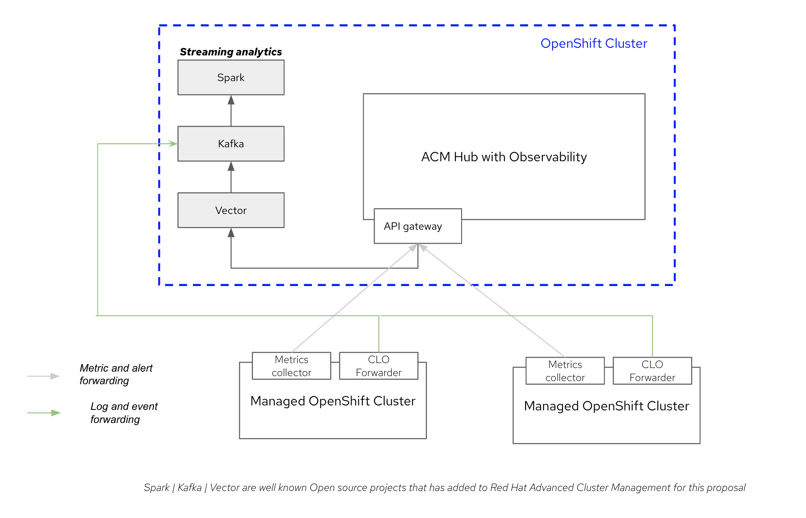
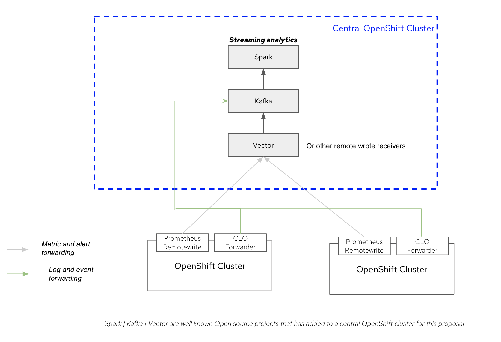

## Objectives
 Our goal is to take Prometheus style metrics, stream it to Kafka and apply streaming analytics in Spark. We are also looking at key cluster events (not to be confused with alerts; alerts already come in through the metric stream) like cluster scaling, node memory pressure, cluster upgrade etc. Speaking in a more generic way - the goal is to build AI/ML/Statistical models around streaming observability data. We could stray to data at rest aka batch processing as well. 
 
 The data flow set up as implemented by the code here is as below.

 

 As you could easily guess, we could easily do this same flow using Prometheus RemoteWrite API instead of ACM. Pros and cons of the above two different methods are really not relevant to the objective of this repository.

 If you used a different metric stream (non-Prometheus) principles applied would be exactly the same. In the python module called in Spark - [simpleKafkaMetricConsumer.py](spark/streaming/simpleKafkaLogConsumer.py) in this example - the schema as seen in `metrics` topic would need to be changed.

 So, a data flow like shown below could be achieved very easily. 

## Spark Streaming

We will follow [Spark Structured Streaming](https://spark.apache.org/docs/3.3.0/structured-streaming-programming-guide.html).

### Initial motivating examples
As a starter, we have added a few simple examples - one for logs and one for metrics.
1. Streaming Metric Analytic -

    Gets streaming metrics and finds out only the active alerts that are firing. [Code here](../obs-streaming/spark/streaming/simpleKafkaMetricConsumer.py).

1. Streaming Log/Event Analytic -

    Gets streaming Infrastructure Logs and Kubernetes events and filters out only the current kubernetes events. [Code here](../obs-streaming/spark/streaming/simpleKafkaLogConsumer.py).

1. Streaming Anomaly Detection on metric -

    _follows soon_

### Getting Started
#### Prereq

For installing the pre-requistes:
1. Install ACM and cofigure Observability
1. Install and configure Kafka
1. Install and configure Vector
1. Configure Observability to route all metrics to Vector
1. Install and configure ClusterLogging Operator- if also interested in logs and events.

follow [this](doc/InstallPreReqs.md).

#### Install and Test Spark

For installing and Testing Spark, follow [this](doc/InstallSpark.md).

#### Building the Docker Driver for Spark

For building docker container for Spark Driver, follow [this](doc/CreateSparkDockerDriver.md).

#### Create a real Spark Application CR

For launching a real Spark Application, follow [this](doc/LaunchSparkJob.md).

 